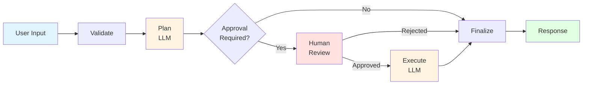

<div align="center">

# 🎯 LangGraph Task Manager

### _Intelligent task planning with human-in-the-loop workflows_

[](https://www.typescriptlang.org/)
[](https://nodejs.org/)
[](https://expressjs.com/)
[](https://langchain.com/)
[](https://nextjs.org/)
[](https://react.dev/)

[**🚀 Live Demo**](https://task-planner-justuzair.vercel.app/) · [**📚 API Docs**](https://documenter.getpostman.com/view/20867739/2sBXVo9To2)

</div>

---

## 📋 Overview

A production-ready agentic workflow system that transforms natural language into actionable task plans using LangGraph's state machine architecture. Features stateful conversations, multi-provider LLM support, and human-in-the-loop approval workflows.



## ✨ Key Features

<table>
<tr>
<td width="50%">

### 🧠 **Intelligent Planning**

- Multi-step task decomposition
- LLM-powered with structured outputs
- Context-aware step generation

### 🔄 **Stateful Workflows**

- Thread-based checkpointing
- Resumable across sessions
- Human-in-the-loop interrupts

</td>
<td width="50%">

### 🛡️ **Production-Ready**

- Rate limiting (10 req/10min)
- CORS & security middleware
- Graceful shutdown handling
- Type-safe with Zod validation

### 🎨 **Multi-Provider LLM**

- OpenAI (GPT-4o-mini)
- Google Gemini (2.5-flash-lite)
- Groq (Llama-3.1-8b-instant)

</td>
</tr>
</table>

## 🏗️ Architecture

```
┌─────────────────┐
│   Next.js 16    │  React 19 · Tailwind CSS 4 · Radix UI
│   Frontend      │
└────────┬────────┘
         │ REST API
         ▼
┌─────────────────┐
│  Express API    │  TypeScript · Rate Limiting · CORS
└────────┬────────┘
         │
         ▼
┌─────────────────┐
│  LangGraph FSM  │  5-Node State Machine
│                 │  ├─ Validate
│                 │  ├─ Plan (LLM)
│                 │  ├─ Approve (HITL)
│                 │  ├─ Execute (LLM)
│                 │  └─ Finalize
└────────┬────────┘
         │
         ▼
┌─────────────────┐
│  LLM Providers  │  Priority-based fallback:
│                 │  Gemini → Groq → OpenAI
└─────────────────┘
```

## 🚀 Quick Start

### Prerequisites

- Node.js 18+
- At least one LLM API key (OpenAI, Google Gemini, or Groq)

### Installation

```bash
# Clone repository
git clone https://github.com/yourusername/langgraph-task-manager.git
cd langgraph-task-manager
```

#### Backend Setup

```bash
cd backend
npm install

# Create .env file
cat > .env << EOF
# Required: At least ONE API key
OPENAI_API_KEY=sk-...
GOOGLE_API_KEY=...
GROQ_API_KEY=...

# Optional: Model configuration
OPENAI_MODEL=gpt-4o-mini
GEMINI_MODEL=gemini-2.5-flash-lite
GROQ_MODEL=llama-3.1-8b-instant

# Optional: Server settings
PORT=8000
FRONTEND_ORIGIN=http://localhost:3000
NODE_ENV=development
EOF

# Start development server
npm run dev
```

#### Frontend Setup

```bash
cd ../client
npm install

# Create .env.local
echo "NEXT_PUBLIC_API_URL=http://localhost:8000" > .env.local

# Start development server
npm run dev
```

Visit `http://localhost:3000` to see the app in action.

## 📦 Environment Variables

### Backend Configuration

| Variable          | Required | Default                 | Description                   |
| ----------------- | :------: | ----------------------- | ----------------------------- |
| `OPENAI_API_KEY`  |    \*    | -                       | OpenAI API key                |
| `GOOGLE_API_KEY`  |    \*    | -                       | Google AI API key             |
| `GROQ_API_KEY`    |    \*    | -                       | Groq API key                  |
| `OPENAI_MODEL`    |    No    | `gpt-4o-mini`           | Model identifier              |
| `GEMINI_MODEL`    |    No    | `gemini-2.5-flash-lite` | Model identifier              |
| `GROQ_MODEL`      |    No    | `llama-3.1-8b-instant`  | Model identifier              |
| `PORT`            |    No    | `5555`                  | Server port                   |
| `FRONTEND_ORIGIN` |    No    | -                       | CORS origin (no trailing `/`) |

\* At least one LLM API key is required

### Frontend Configuration

| Variable              | Required | Default | Description     |
| --------------------- | :------: | ------- | --------------- |
| `NEXT_PUBLIC_API_URL` |   Yes    | -       | Backend API URL |

## 🔗 API Overview

Full documentation available in [Postman Collection](https://documenter.getpostman.com/view/20867739/2sBXVo9To2)

### Quick Reference

| Endpoint                | Method | Description                     |
| ----------------------- | ------ | ------------------------------- |
| `/api/v1/agent`         | POST   | Start new task planning session |
| `/api/v1/agent/approve` | POST   | Resume workflow with approval   |
| `/status`               | GET    | Health check                    |

**Example Request:**

```bash
curl -X POST https://your-backend.vercel.app/api/v1/agent \
  -H "Content-Type: application/json" \
  -d '{"input": "Plan a team offsite event"}'
```

**Rate Limits:** 10 requests per 10 minutes per IP

## 🎯 Technical Highlights

<details>
<summary><b>🔹 Advanced TypeScript Patterns</b></summary>

- Discriminated unions for type-safe API responses
- Zod schemas for runtime validation
- Generic type constraints with conditional routing
- End-to-end type safety with no `any` types
</details>

<details>
<summary><b>🔹 Production-Ready Node.js</b></summary>

- SIGTERM handling for graceful shutdowns
- Comprehensive async error boundaries
- Security-first middleware (rate limiting, CORS, request validation)
- Structured logging with IST timezone
</details>

<details>
<summary><b>🔹 LangGraph State Machine</b></summary>

- Conditional edge routing based on state
- Thread-based checkpointing for resumable workflows
- Human-in-the-loop interrupt patterns
- In-memory persistence (production: PostgreSQL/Redis recommended)
</details>

<details>
<summary><b>🔹 LLM Engineering</b></summary>

- Multi-provider abstraction with automatic fallback
- Structured outputs with Zod validation
- Temperature-controlled generation (0.3)
- Prompt engineering for consistent, beginner-friendly outputs
</details>

<details>
<summary><b>🔹 Serverless Optimization</b></summary>

- Bundled with tsup for optimal cold starts
- ES module compatibility resolved at build time
- Single-file deployment for Vercel functions
- Environment-based configuration
</details>

## 🚢 Deployment

### Backend (Vercel)

```bash
cd backend
vercel --prod
```

Configure environment variables in Vercel dashboard (Project Settings → Environment Variables)

### Frontend (Vercel)

```bash
cd client
vercel --prod
```

Set `NEXT_PUBLIC_API_URL` to your deployed backend URL

## 🤝 Built With

- **Backend:** TypeScript, Express, LangGraph, LangChain
- **Frontend:** Next.js, React, Tailwind CSS, Radix UI
- **LLM:** OpenAI, Google Gemini, Groq
- **Deployment:** Vercel Serverless
- **Validation:** Zod
- **Bundling:** tsup

## 📄 License

ISC License

---

<div align="center">

**[Live Demo](https://task-planner-justuzair.vercel.app/) · [API Docs](https://documenter.getpostman.com/view/20867739/2sBXVo9To2)**

_Built to showcase production-grade agentic workflows with LangGraph_

</div>
